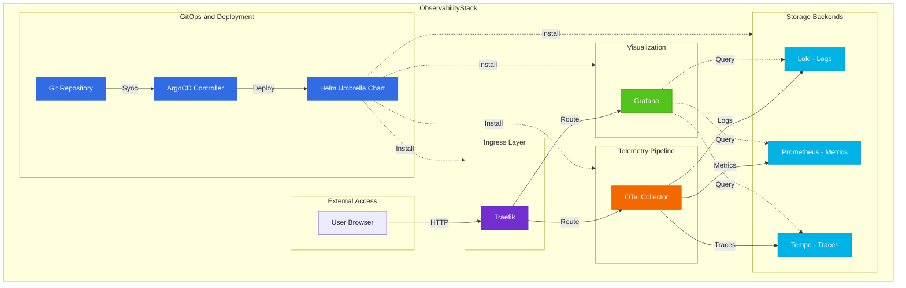

# Architecture Guide

This document explains the **design decisions**, **architectural patterns**, and **configuration philosophy** behind the ObservabilityStack.

## Table of Contents

- [Architecture Guide](#architecture-guide)
  - [Table of Contents](#table-of-contents)
  - [Stack Configuration](#stack-configuration)
    - [Configuration Structure](#configuration-structure)
  - [Architecture Overview](#architecture-overview)
    - [Component Responsibilities](#component-responsibilities)
  - [Helm Umbrella Chart Pattern](#helm-umbrella-chart-pattern)
    - [Umbrella Chart Structure](#umbrella-chart-structure)
      - [How the Umbrella Pattern Works](#how-the-umbrella-pattern-works)
    - [Multi-Values Configuration](#multi-values-configuration)
    - [Understanding Subcharts](#understanding-subcharts)
      - [**How Subcharts Work**](#how-subcharts-work)
      - [**Subchart Configuration Patterns**](#subchart-configuration-patterns)
      - [Declarative Infrastructure (GitOps with ArgoCD)](#declarative-infrastructure-gitops-with-argocd)
      - [**Adding New Components**](#adding-new-components)
  - [Configuration Management](#configuration-management)
    - [Editing Component Configuration](#editing-component-configuration)
    - [Finding Configuration Options](#finding-configuration-options)
  - [Next Steps](#next-steps)

## Stack Configuration

### Configuration Structure
- **Umbrella chart pattern** - All components managed as subcharts
- **GitOps deployment** - Changes managed through Git commits
- **Local filesystem storage** - No external storage dependencies

## Architecture Overview


### Component Responsibilities

| Component | Role | Function |
|-----------|------|----------|
| **ArgoCD** | GitOps Controller | Manages deployments from Git repository |
| **Traefik** | Ingress Controller | Routes external traffic to services |
| **Loki** | Log Aggregation | Stores and queries log data |
| **Tempo** | Trace Storage | Stores and queries distributed traces |
| **Prometheus** | Metrics Collection | Collects and stores time-series metrics |
| **Grafana** | Visualization | Provides dashboards for logs, metrics, and traces |
| **OTEL Collector** | Telemetry Pipeline | Receives, processes, and routes telemetry data |

## Helm Umbrella Chart Pattern

### Umbrella Chart Structure

The `helm/stackcharts/` directory contains an **umbrella chart** that packages all components together:

```
helm/stackcharts/
├── Chart.yaml           # Umbrella chart definition
├── Chart.lock          # Dependency lock file  
├── values/             # Split configuration files (one per component)
│   ├── base.yaml           # Component enable/disable flags
│   ├── loki.yaml           # Loki configuration
│   ├── tempo.yaml          # Tempo configuration
│   ├── prometheus.yaml     # Prometheus configuration
│   ├── grafana.yaml        # Grafana configuration
│   ├── minio.yaml          # Minio configuration
│   └── opentelemetry-collector.yaml  # OTel configuration
└── charts/             # Downloaded dependencies (.tgz files)
    ├── grafana-10.0.0.tgz
    ├── loki-6.36.0.tgz
    ├── prometheus-27.30.0.tgz
    └── ...
```

#### How the Umbrella Pattern Works

**With ArgoCD (Automated - Recommended)**
```bash
# ArgoCD handles all value files automatically
kubectl apply -f argocd/observability-stack.yaml -n argocd
```
**Single Deployment Command**
```bash
# Deploy entire stack with one command
helm install observability-stack ./helm/stackcharts \
  -f helm/stackcharts/values/base.yaml \
  -f helm/stackcharts/values/loki.yaml \
  -f helm/stackcharts/values/tempo.yaml \
  -f helm/stackcharts/values/prometheus.yaml \
  -f helm/stackcharts/values/grafana.yaml \
  -f helm/stackcharts/values/minio.yaml \
  -f helm/stackcharts/values/opentelemetry-collector.yaml \
  -n observability-lab
```
**Version Management**
- `Chart.yaml` defines specific versions for all components
- `Chart.lock` locks exact versions for reproducible deployments
- `helm dependency update` downloads and packages all components

**Dependency Definition**
```yaml
# Chart.yaml automatically handles component relationships
dependencies:
  - name: grafana
    version: "10.0.0"
    repository: "https://grafana.github.io/helm-charts"
    condition: grafana.enabled        # Controlled by values/base.yaml
  - name: loki
    version: "6.36.0" 
    repository: "https://grafana.github.io/helm-charts"
    condition: loki.enabled           # Controlled by values/base.yaml
```

### Multi-Values Configuration

Configuration is split into separate files for maintainability:

**Base Configuration (`values/base.yaml`)**
```yaml
# Controls which components are installed
loki:
  enabled: true
tempo:
  enabled: true
prometheus:
  enabled: true
grafana:
  enabled: true
minio:
  enabled: false  # Disabled - using filesystem storage
opentelemetry-collector:
  enabled: true
```

**Component Configuration (e.g., `values/grafana.yaml`)**
```yaml
# Grafana-specific settings
grafana:
  fullnameOverride: grafana
  replicas: 1
  datasources:
    datasources.yaml:
      apiVersion: 1
      datasources:
        - name: Prometheus
          type: prometheus
          url: http://prometheus
        - name: Loki
          type: loki
          url: http://loki-gateway
  # ... more Grafana config
```

### Understanding Subcharts

Each dependency becomes a **subchart** within the umbrella chart:

```
helm/stackcharts/
├── Chart.yaml              # Parent chart definition
├── values/                 # Split values files
│   ├── base.yaml              # Enable flags
│   ├── loki.yaml              # Loki config → loki subchart
│   ├── grafana.yaml           # Grafana config → grafana subchart
│   └── ...
├── Chart.lock             # Locked subchart versions
└── charts/                # Downloaded subcharts
    ├── grafana-10.0.0.tgz     # Subchart: Grafana
    ├── loki-6.36.0.tgz        # Subchart: Loki  
    ├── prometheus-27.30.0.tgz # Subchart: Prometheus
    └── ...
```

#### **How Subcharts Work**

**Value Inheritance**
```yaml
# values/grafana.yaml - Passed to grafana subchart
grafana:                    # ← Top-level key matches subchart name
  adminPassword: secretpwd
  datasources: [...]
  
# values/loki.yaml - Passed to loki subchart
loki:                      # ← Top-level key matches subchart name
  singleBinary:
    replicas: 1
    
# values/prometheus.yaml - Passed to prometheus subchart
prometheus:                # ← Top-level key matches subchart name
  server:
    persistentVolume:
      size: 8Gi
```

**How Helm Merges Values:**
1. Helm reads all `-f` files in order (base.yaml first, then components)
2. Each file with matching top-level key (e.g., `loki:`) is merged
3. Later values override earlier ones
4. Final merged config is passed to each subchart

**Subchart Templates**
Each subchart has its own templates that get rendered:
```
grafana subchart templates → grafana-deployment.yaml, grafana-service.yaml
loki subchart templates    → loki-statefulset.yaml, loki-configmap.yaml  
prometheus subchart templates → prometheus-deployment.yaml, etc.
```

**Dependency Management**
```bash
# Download/update all subcharts
helm dependency update helm/stackcharts/

# This downloads:
# - grafana-9.3.2.tgz from https://grafana.github.io/helm-charts  
# - loki-6.36.0.tgz from https://grafana.github.io/helm-charts
# - etc.
```

#### **Subchart Configuration Patterns**

**Global Values**
```yaml
# Shared across all subcharts
global:
  storageClass: "local-path"
  imagePullSecrets: []
  
# Each subchart can access global values
grafana:
  # Uses global.storageClass automatically
  persistence:
    enabled: true
    
loki:  
  # Also uses global.storageClass
  persistence:
    enabled: true
```

**Conditional Subcharts**
The `condition` field in `Chart.yaml` determines which subcharts are installed:

```yaml
# Chart.yaml - Defines the conditions
dependencies:
  - name: loki
    version: "6.36.0" 
    repository: "https://grafana.github.io/helm-charts"
    condition: loki.enabled        # ← Controls if this subchart installs
  
  - name: grafana
    version: "10.0.0"
    repository: "https://grafana.github.io/helm-charts" 
    condition: grafana.enabled     # ← Controls if this subchart installs
```

```yaml
# values/base.yaml - Sets the condition values
loki:
  enabled: true    # ← This value is checked by "condition: loki.enabled"

grafana:
  enabled: true    # ← This value is checked by "condition: grafana.enabled"  

tempo:
  enabled: false   # ← Setting to false will skip tempo installation
```

**How It Works:**
- Helm checks `values/base.yaml` for the condition path (e.g., `loki.enabled`)
- If `true`, the subchart is included in deployment
- If `false` or missing, the subchart is skipped entirely
- This allows selective component installation from the same umbrella chart

**Practical Examples:**
```bash
# Deploy only logs and visualization (no metrics or tracing)
# In values/base.yaml:
loki:
  enabled: true
grafana: 
  enabled: true
prometheus:
  enabled: false   # Skip metrics collection
tempo:
  enabled: false   # Skip tracing
opentelemetry-collector:
  enabled: true    # Keep collector for log processing
```

**Cross-Subchart References**
```yaml
# Grafana subchart references other subcharts
grafana:
  datasources:
    datasources.yaml:
      datasources:
      - name: Prometheus
        # Reference to prometheus subchart service
        url: http://{{ include "prometheus.fullname" . }}:{{ .Values.prometheus.server.service.port }}
      - name: Loki  
        # Reference to loki subchart service
        url: http://{{ include "loki.serviceName" . }}:{{ .Values.loki.service.port }}
```


#### Declarative Infrastructure (GitOps with ArgoCD)

**ArgoCD Application Configuration:**
```yaml
# argocd/observability-stack.yaml
apiVersion: argoproj.io/v1alpha1
kind: Application
metadata:
  name: observability-stack
spec:
  source:
    repoURL: 'https://github.com/fiddeb/observabilitystack.git'
    path: helm/stackcharts        # Points to umbrella chart
    targetRevision: main          # Tracks main branch
    helm:
      valueFiles:                 # Multi-values configuration
        - values/base.yaml
        - values/loki.yaml
        - values/tempo.yaml
        - values/prometheus.yaml
        - values/grafana.yaml
        - values/minio.yaml
        - values/opentelemetry-collector.yaml
```

**Change Workflow:**
1. Edit relevant values file (e.g., `values/grafana.yaml`)
2. Commit to Git: `git add helm/stackcharts/values/grafana.yaml && git commit -m "feat: update grafana"`
3. Push to GitHub: `git push`
4. ArgoCD auto-syncs (or force with `./scripts/force_argo_sync.sh`)
5. See changes in ArgoCD UI: http://argocd.k8s.test


#### **Adding New Components**

To add a new component (e.g., Jaeger for tracing):

**1. Add to Chart.yaml dependencies:**
```yaml
# helm/stackcharts/Chart.yaml
dependencies:
  - name: jaeger
    version: "0.71.2"
    repository: https://jaegertracing.github.io/helm-charts
    condition: jaeger.enabled
```

**2. Create values file:**
```yaml
# helm/stackcharts/values/jaeger.yaml
jaeger:
  fullnameOverride: jaeger
  # ... jaeger configuration
```

**3. Add enable flag:**
```yaml
# helm/stackcharts/values/base.yaml
jaeger:
  enabled: true
```

**4. Update ArgoCD Application:**
```yaml
# argocd/observability-stack.yaml
spec:
  source:
    helm:
      valueFiles:
        - values/base.yaml
        # ... existing files
        - values/jaeger.yaml    # Add new file
```

**5. Update dependencies and commit:**
```bash
helm dependency update helm/stackcharts/
git add helm/stackcharts/
git commit -m "feat: add Jaeger tracing"
git push
```

---

## Configuration Management

### Editing Component Configuration

Each component has its own values file in `helm/stackcharts/values/`:

**Example: Updating Grafana datasources**

1. **Edit the component file:**
   ```bash
   vim helm/stackcharts/values/grafana.yaml
   ```

2. **Make your changes:**
   ```yaml
   grafana:
     datasources:
       datasources.yaml:
         apiVersion: 1
         datasources:
         - name: Prometheus
           type: prometheus
           url: http://prometheus
         - name: NewDatasource  # Add new datasource
           type: influxdb
           url: http://influxdb:8086
   ```

3. **Commit and push:**
   ```bash
   git add helm/stackcharts/values/grafana.yaml
   git commit -m "feat: add InfluxDB datasource to Grafana"
   git push
   ```

4. **ArgoCD syncs automatically** (or force: `./scripts/force_argo_sync.sh`)


Commit and push - ArgoCD will remove Tempo resources automatically.

### Finding Configuration Options

Each component has extensive configuration options:

1. **Check component values file:**
   ```bash
   # See all Loki options
   cat helm/stackcharts/values/loki.yaml
   ```

2. **Check upstream chart documentation:**
   - Grafana: https://github.com/grafana/helm-charts/tree/main/charts/grafana
   - Loki: https://github.com/grafana/helm-charts/tree/main/charts/loki
   - Tempo: https://github.com/grafana/helm-charts/tree/main/charts/tempo
   - Prometheus: https://github.com/prometheus-community/helm-charts/tree/main/charts/prometheus

3. **Extract default values from charts:**
   ```bash
   helm show values grafana/grafana > /tmp/grafana-defaults.yaml
   helm show values grafana/loki > /tmp/loki-defaults.yaml
   ```

---

## Next Steps

After understanding this architecture:

1. **Read**: [Installation Guide](INSTALLATION.md) for setup
2. **Practice**: [Usage Guide](USAGE_GUIDE.md) for hands-on experience  
3. **Customize**: Edit component files in `helm/stackcharts/values/` for your specific needs
4. **Monitor**: Use [Troubleshooting Guide](TROUBLESHOOTING.md) when issues arise
