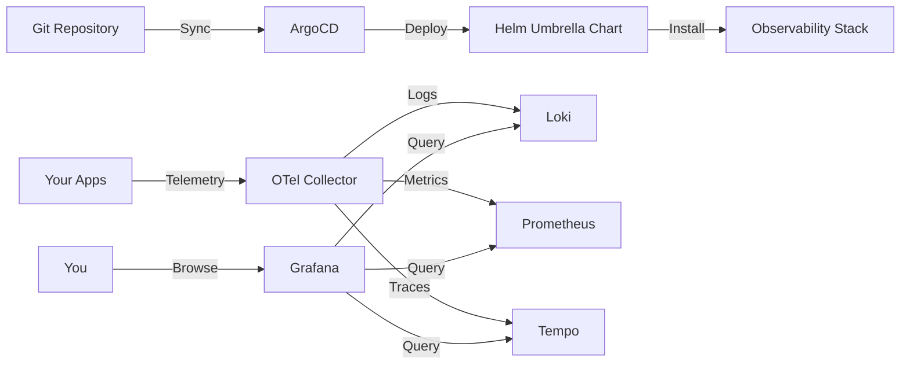

# ObservabilityStack Documentation

Welcome to the **ObservabilityStack** documentation! This is a GitOps-managed observability platform built for local Kubernetes clusters, designed for development, learning, and experimentation.

## What is ObservabilityStack?

A complete observability stack featuring:

- **OpenTelemetry Collector** - Unified telemetry pipeline
- **Grafana** - Visualization and dashboards
- **Loki** - Log aggregation with multi-tenant support
- **Tempo** - Distributed tracing
- **Prometheus** - Metrics collection
- **ArgoCD** - GitOps deployment management

All components are managed through a **Helm umbrella chart pattern** and deployed via **ArgoCD** for a true GitOps experience.

## Quick Navigation

### Getting Started
- **[Installation Guide](guides/INSTALLATION.md)** - Setup from zero to running system
- **[Usage Guide](guides/USAGE_GUIDE.md)** - Send and query telemetry data

### Understanding the System
- **[Architecture Guide](guides/ARCHITECTURE.md)** - Umbrella chart pattern and design decisions
- **[Git Workflow](guides/GIT_WORKFLOW.md)** - Branch management and deployment workflows

### Advanced Topics
- **[Batch Optimization](advanced/BATCH_OPTIMIZATION.md)** - Performance tuning results
- **[Mimir Setup](advanced/MIMIR_SETUP.md)** - Long-term metrics storage

### When Things Go Wrong
- **[Troubleshooting Guide](guides/TROUBLESHOOTING.md)** - Emergency procedures and debugging

## Key Features

✅ **GitOps-Native** - All changes managed through Git commits  
✅ **Multi-Tenant Ready** - Isolated data with tenant support  
✅ **Resource Optimized** - Runs efficiently on local machines  
✅ **Educational** - Perfect for learning observability concepts  
✅ **Production Patterns** - Uses real-world architectural patterns  

## Quick Start

```bash
# Clone the repository
git clone https://github.com/fiddeb/observabilitystack.git
cd observabilitystack

# Install everything with one command
./scripts/install_argo.sh
```

**Access your stack:**
- Grafana: http://grafana.k8s.test
- ArgoCD: http://argocd.k8s.test
- Prometheus: http://prometheus.k8s.test
- Loki: http://loki.k8s.test

## Documentation Structure

This documentation is organized into focused guides:

| Guide | Purpose |
|-------|---------|
| **[Installation](guides/INSTALLATION.md)** | Prerequisites, DNS setup, installation steps |
| **[Architecture](guides/ARCHITECTURE.md)** | Umbrella chart pattern, GitOps workflow, configuration |
| **[Usage](guides/USAGE_GUIDE.md)** | Sending logs/metrics/traces, querying data, dashboards |
| **[Git Workflow](guides/GIT_WORKFLOW.md)** | Feature branches, safe merging, ArgoCD integration |
| **[Troubleshooting](guides/TROUBLESHOOTING.md)** | Common issues, debugging, emergency procedures |
| **[Batch Optimization](advanced/BATCH_OPTIMIZATION.md)** | Performance tuning and results |
| **[Mimir Setup](advanced/MIMIR_SETUP.md)** | Long-term metrics storage |

## Architecture at a Glance



**Key Concepts:**
- **Umbrella Chart** - Single Helm chart manages all components as dependencies
- **Multi-Values** - Configuration split across files (one per component)
- **GitOps** - ArgoCD syncs from Git, ensuring declarative infrastructure
- **Local First** - Designed for local Kubernetes (Rancher Desktop, minikube, k3d)

## Platform Support

| Platform | Status | Notes |
|----------|--------|-------|
| macOS | ✅ Fully Supported | Wildcard DNS via dnsmasq |
| Linux | ✅ Fully Supported | Wildcard DNS via dnsmasq |
| Windows | ⚠️ Limited | Static hosts file only (no wildcard DNS) |

## Need Help?

- **Installation issues?** → [Installation Guide](guides/INSTALLATION.md)
- **How do I...?** → [Usage Guide](guides/USAGE_GUIDE.md)
- **Something broken?** → [Troubleshooting Guide](guides/TROUBLESHOOTING.md)
- **Understanding design?** → [Architecture Guide](guides/ARCHITECTURE.md)

## Contributing

We welcome contributions! Please:
1. Fork the repository
2. Create a feature branch
3. Follow the [Git Workflow](guides/GIT_WORKFLOW.md)
4. Submit a pull request

## License

MIT License - See [LICENSE](../LICENSE) for details.

---

**Ready to get started?** Head to the [Installation Guide](INSTALLATION.md) →